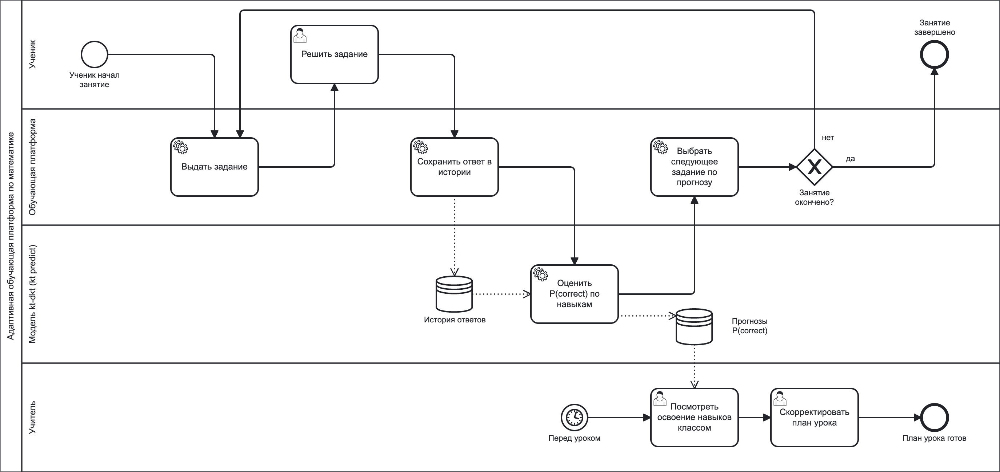

# Место модели в процессе обучения (BPMN)

Модель `kt-dkt` ([model_card.md](model_card.md)) работает внутри адаптивной
обучающей платформы по школьной математике. Схема показывает цикл занятия
ученика и то, как учитель использует результаты модели.

Исходник схемы — [docs/bpmn/model_process.bpmn](docs/bpmn/model_process.bpmn)
(BPMN 2.0, открывается в [Camunda Modeler](https://camunda.com/download/modeler/)
или на [demo.bpmn.io](https://demo.bpmn.io/)).

## Процесс

1. Платформа выдаёт ученику задание, ученик его решает.
2. Ответ сохраняется в истории ответов ученика.
3. Модель по всей истории ученика рассчитывает вероятность правильного ответа
   на следующее задание по каждому из 109 навыков; прогнозы сохраняются.
4. Платформа выбирает следующее задание по прогнозу. Если занятие не
   окончено, цикл повторяется.
5. Перед уроком учитель смотрит, как класс освоил навыки, и корректирует план
   урока.

## Какую задачу в процессе решает модель

Модель оценивает текущий уровень знаний ученика по каждому навыку — то, что
нельзя увидеть напрямую. Без этой оценки платформа выдавала бы задания в
фиксированном порядке, а учитель не знал бы, какие темы класс уже освоил, а
какие нужно повторить.

## Почему для этой задачи целесообразно использовать ML

- Знание навыка не измеряется напрямую: видны только ответы, а они
  зашумлены — ученик может угадать или ошибиться по невнимательности.
- Простые правила вроде «три правильных ответа подряд — навык освоен» (так
  работают задания ASSISTments skill builder) не учитывают всю историю
  ученика, связи между навыками и разную сложность навыков. Модель извлекает
  эти закономерности из 215 тыс. ответов 3,9 тыс. учеников.
- Выигрыш подтверждён на отложенных учениках: ROC-AUC 0.80 против 0.72 у
  классической вероятностной модели BKT.
- Оценка нужна после каждого ответа и для тысяч учеников одновременно, что
  вручную невозможно.

## Какие данные поступают на вход модели

История ответов ученика из платформы — все его попытки по порядку:

- `user_id` — ученик;
- `order_idx` — порядковый номер попытки;
- `skill_id` — навык, к которому относится задание (классификация
  ASSISTments, 109 навыков);
- `correct` — правильность ответа: 0 или 1.

Пример — [examples/history.csv](examples/history.csv); формат подробно описан в
[model_card.md](model_card.md#input-format--входные-данные).

## Как результат работы модели используется дальше

Выход модели — вероятность правильного ответа `p_correct` по каждому навыку
для каждого ученика:

- **платформа** выбирает следующее задание: в приоритете навыки с низкой
  вероятностью; навык с вероятностью выше порога освоения считается
  освоенным, и ученик переходит к следующей теме;
- **учитель** видит освоение навыков по классу и корректирует план урока;
- **мониторинг** сравнивает прогнозы с фактическими ответами, а новые данные — с
  обучающими; при дрейфе или падении качества запускается переобучение
  ([Model_retrain_BPMN.md](Model_retrain_BPMN.md)).
