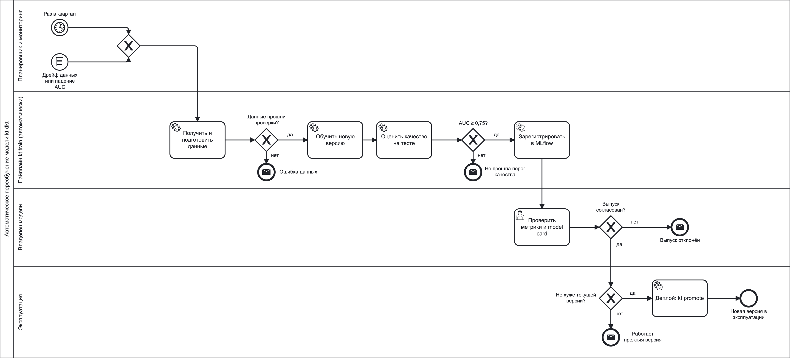

# Автоматическое переобучение модели (BPMN)

Процесс переобучения модели `kt-dkt` ([model_card.md](model_card.md)) — от
триггера до развёртывания новой версии. Переобучение запускается и
выполняется автоматически; в эксплуатацию новая версия попадает только после
автоматических проверок и согласования владельцем модели. Пока новая версия
не выпущена, работает текущая — версия с алиасом `champion` в MLflow Model
Registry.

Исходник схемы — [docs/bpmn/model_retrain.bpmn](docs/bpmn/model_retrain.bpmn)
(BPMN 2.0, открывается в [Camunda Modeler](https://camunda.com/download/modeler/)
или на [demo.bpmn.io](https://demo.bpmn.io/)).

## Этапы

| Этап | Что происходит | Что передаётся дальше |
|---|---|---|
| 1. Триггер | Переобучение запускается по расписанию — раз в квартал — или по сигналу мониторинга: значимый дрейф новых данных относительно обучающих (PSI ≥ 0.25 хотя бы по одному признаку, `monitoring/drift.py`) или ROC-AUC на свежих ответах ниже 0.75. Расписание задаёт внешний планировщик (например, cron), который вызывает `kt train --data-source full`; вручную переобучение запускается той же командой. | Запуск пайплайна |
| 2. Получение и подготовка данных | Extract загружает свежую выгрузку ответов (адреса источников — `data.source_url_*` в `config/config.yaml`). Transform очищает данные, строит признаки и разбивает учеников на train / validation / test. Затем выполняются пять проверок качества данных: схема, пропуски, метки 0/1, диапазон навыков, уникальность попыток. | Подготовленные выборки в `data/processed/` и отчёт о проверках |
| 3. Обучение новой версии | Optuna подбирает архитектуру DKT (25 испытаний), лучшая конфигурация обучается заново. Для сравнения обучаются BKT, DKT без подбора и AutoML. Параметры и метрики записываются в MLflow. | Обученная модель и запуск MLflow |
| 4. Проверка качества | Считаются метрики на тестовой выборке (ROC-AUC, accuracy, F1, RMSE, log-loss), отчёт о дрейфе и графики. Шлюз качества: ROC-AUC не ниже 0.75 (`serving.min_test_auc`); только такая версия может стать кандидатом на публикацию. | `artifacts/metrics.json`, отчёты; версия, прошедшая порог |
| 5. Регистрация новой версии | Модель сохраняется в `artifacts/model/` (веса и описание) и регистрируется в MLflow Model Registry как новая версия `kt-dkt` с алиасом `challenger` и тегом `test_auc`. | Версия-кандидат в реестре |
| 6. Решение о публикации | Владелец модели проверяет метрики, в том числе по подгруппам (`scripts/sliced_metrics.py`), и обновляет [model_card.md](model_card.md). После согласования запускается `kt promote`: он сравнивает ROC-AUC кандидата с текущей рабочей версией. | Согласованная версия, не уступающая текущей |
| 7. Деплой | `kt promote` переводит алиас `champion` на новую версию. Сервис предсказаний загружает модель по ссылке `models:/kt-dkt@champion` (`kt predict`, Docker-образ), поэтому новая версия начинает использоваться без изменения кода. Предыдущая версия остаётся в реестре. | Новая версия в эксплуатации; мониторинг продолжает работу и при необходимости снова запускает процесс |

## При каких условиях новая версия попадает в эксплуатацию

Должны выполниться все четыре условия:

1. данные прошли все пять проверок качества;
2. ROC-AUC на тестовой выборке не ниже 0.75;
3. владелец модели согласовал выпуск;
4. ROC-AUC не ниже, чем у текущей рабочей версии (`champion`).

## Действия при неуспешных проверках

В каждом из этих случаев в эксплуатации остаётся текущая версия, а ML-инженер
получает оповещение (на схеме — конечные события с конвертом).

| Где остановился процесс | Что происходит | Что дальше |
|---|---|---|
| Проверки данных | `kt train` останавливается до обучения (код выхода 3) | исправить выгрузку или источник данных и перезапустить переобучение |
| Порог качества | версия не регистрируется | разобрать причину: дрейф данных, новые навыки, гиперпараметры |
| Согласование | версия остаётся кандидатом (`challenger`) и не выпускается | доработать модель по замечаниям владельца |
| Сравнение с текущей версией | `kt promote` отказывает (код выхода 4) | оставить текущую версию; выпуск вопреки правилу — только осознанно, `kt promote --force` |

Если после выпуска мониторинг показывает падение качества, алиас `champion`
возвращается на предыдущую версию в MLflow — это откат без переобучения.
