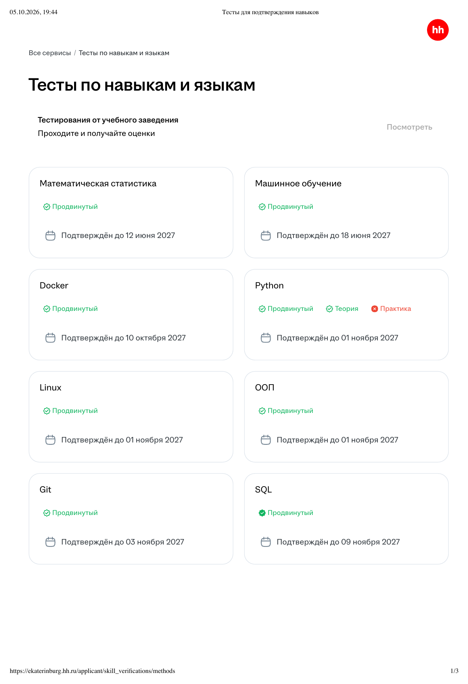

# Отчёт по практике: подготовка ML-проекта к production

**Автор:** Григорьева Е.С. · **Дата:** октябрь 2026 ·
**Репозиторий:** <https://github.com/EkaterinaGrisha/knowledge-tracing-mlops> ·
**Версия проекта:** 2.0.0 (исходное состояние — тег `v1.0.0-baseline`)

Проект — автоматизированный ML-пайплайн knowledge tracing на датасете
ASSISTments 2009: ETL, четыре модели (BKT, DKT, DKT+Optuna, FLAML AutoML),
мониторинг, MLflow, Docker, CI. Подробное описание самого пайплайна — в
[README.md](README.md); здесь — что сделано по заданию практики, где это
лежит в репозитории и как это проверить.

## 1. Задание и итог

| № | Пункт задания | Итог | Где смотреть | Pull Request |
|---|---|---|---|---|
| 1 | Тесты hh.ru: машинное обучение, Python (теория и практика), SQL (теория и практика), Docker, Git, Linux, ООП | сданы все, кроме практики по Python (пересдаётся) | §3, [docs/hh_tests/](docs/hh_tests/) | — |
| 2 | Рефакторинг кода ML-проекта под production-стандарты | ✅ | §5, `src/knowledge_tracing/` | [#3](https://github.com/EkaterinaGrisha/knowledge-tracing-mlops/pull/3) |
| 3 | Настройка pre-commit, Poetry, линтеров | ✅ | §6–7, `pyproject.toml`, `.pre-commit-config.yaml` | [#1](https://github.com/EkaterinaGrisha/knowledge-tracing-mlops/pull/1), [#2](https://github.com/EkaterinaGrisha/knowledge-tracing-mlops/pull/2) |
| 4 | Интеграция виртуального окружения в Git-репозиторий | ✅ | §6, `poetry.toml`, `poetry.lock`, `.python-version` | [#1](https://github.com/EkaterinaGrisha/knowledge-tracing-mlops/pull/1) |

Сверх задания: карточка модели [MODEL_CARD.md](MODEL_CARD.md),
[BPMN-процесс жизненного цикла и согласования модели](docs/model_lifecycle.md),
упаковка модели и MLflow Model Registry, [CHANGELOG.md](CHANGELOG.md) —
Pull Request [#4](https://github.com/EkaterinaGrisha/knowledge-tracing-mlops/pull/4)–[#6](https://github.com/EkaterinaGrisha/knowledge-tracing-mlops/pull/6).

## 2. Как велась работа

- **Исходный проект не изменялся.** Работа велась в копии с полной историей
  коммитов; исходное состояние отмечено тегом `v1.0.0-baseline`, исходный
  репозиторий [knowledge-tracing](https://github.com/EkaterinaGrisha/knowledge-tracing)
  остался на коммите `89ea01e`.
- **Каждый этап — отдельная ветка и Pull Request** с описанием «было → стало»
  и зелёным CI; слияние в `main` — только после проверки. Ветка `main`
  защищена: Pull Request и проверки `lint-and-test`, `docker-smoke`
  обязательны.
- **Поведение проверялось после каждого шага.** Перед рефакторингом
  сохранены эталонные метрики исходного кода
  ([docs/baseline/](docs/baseline/)); после каждого шага быстрый прогон
  сравнивался с ними скриптом `scripts/compare_metrics.py` (§5.4).

## 3. Тесты hh.ru (пункт 1)

Страница «Тесты по навыкам и языкам» сохранена 05.10.2026:
[docs/hh_tests/hh_tests.png](docs/hh_tests/hh_tests.png) и
[PDF](docs/hh_tests/hh_tests.pdf).

| Тест | Результат | Подтверждён до |
|---|---|---|
| Машинное обучение | ✅ Продвинутый | 18.06.2027 |
| Python — теория | ✅ | 01.11.2027 |
| Python — практика | ❌ не сдана, пересдаётся | — |
| SQL | ✅ Продвинутый | 09.11.2027 |
| Docker | ✅ Продвинутый | 10.10.2027 |
| Git | ✅ Продвинутый | 03.11.2027 |
| Linux | ✅ Продвинутый | 01.11.2027 |
| ООП | ✅ Продвинутый | 01.11.2027 |
| Математическая статистика (дополнительно) | ✅ Продвинутый | 12.06.2027 |



## 4. Исходное состояние (`v1.0.0-baseline`)

- зависимости в `requirements.txt` только с нижними границами версий, без
  lock-файла; `pytest` и `ruff` вперемешку с runtime-зависимостями
  попадали в Docker-образ; torch ставился отдельно в трёх местах;
- настройки pytest продублированы в `pytest.ini` и `pyproject.toml` —
  действовал только `pytest.ini`;
- код — пакет с именем `src` (`from src.models import …`), пути
  вычислялись от расположения файла пакета;
- функция `pipeline.run()` на 160 строк: ETL, свой блок кода на каждую из
  четырёх моделей, MLflow и отчёт в одном месте; каждая модель сама считала
  метрики, пайплайн их выбрасывал и считал заново;
- линтер ruff с базовыми правилами E/F/I/W, без pre-commit и mypy:
  с итоговым набором правил исходный код даёт 145 замечаний и 12
  неотформатированных файлов;
- 17 тестов, покрытие не измерялось.

## 5. Рефакторинг под production-стандарты (пункт 2)

Pull Request [#3](https://github.com/EkaterinaGrisha/knowledge-tracing-mlops/pull/3),
16 коммитов — по одному на шаг.

### 5.1 Структура

```
src/knowledge_tracing/          # устанавливаемый пакет (было: пакет src)
├── cli.py                      # команда kt: etl, train, predict, promote
├── config.py                   # типизированная конфигурация (pydantic)
├── pipeline.py                 # стадии пайплайна
├── tracking.py                 # MLflow: хранилище, реестр, алиасы
├── inference.py                # упаковка модели и предсказания
├── runtime.py, logging_setup.py, errors.py
├── etl/                        # extract, transform, load, run, datasets
├── models/                     # base (интерфейс), registry, bkt, dkt, dkt_optuna, automl_flaml
├── evaluation/                 # metrics, visualize
└── monitoring/                 # data_quality, drift, resources
```

### 5.2 Что изменено

| Было | Стало |
|---|---|
| Пакет `src`, пути от расположения файла | пакет `knowledge_tracing` (src-layout), пути от корня проекта |
| Конфигурация — словарь без проверки; `--quick` правил его в коде | схема pydantic: опечатка в ключе или недопустимое значение останавливают запуск сразу (код выхода 2); оверлей `config/quick.yaml` |
| `run()` на 160 строк | стадии `etl_stage → check_data_quality → train_and_evaluate → monitor_drift → build_figures → package_model`; общий интерфейс `KnowledgeTracingModel` и реестр моделей |
| Метрики считались в каждой модели и повторно в пайплайне | модели возвращают предсказания, метрики считаются в одном месте |
| Два argparse-входа, переменные окружения в Makefile и скриптах | единая команда `kt`; настройки OpenMP для macOS применяет сама команда |
| Общий логгер с обработчиком в каждом модуле; импорт меняет глобальные настройки matplotlib и seaborn | логгеры модулей, настройка один раз в точке входа; графики без глобального состояния (попиксельно те же) |
| Лучшая модель нигде не сохранялась | упаковка в `artifacts/model`, pyfunc-модель в MLflow, регистрация `challenger` при AUC ≥ 0.75, `kt predict`, `kt promote` (`champion`, без ухудшения) |
| Прогон перезаписывал закоммиченные результаты в `reports/` | прогоны пишут в `artifacts/`, публикация — `make publish-report` |
| Нет docstrings, магические числа | docstrings (pydocstyle), именованные константы, mypy требует аннотации у всех функций пакета |
| 17 тестов | 53 теста (49 быстрых и 4 медленных — с обучением моделей), покрытие 96 %, порог 90 % в CI |

### 5.3 Найденные и исправленные ошибки

- `mlflow.tracking_uri` из конфигурации игнорировался — путь был зашит в код;
- data-quality gate только писал предупреждение и не останавливал обучение;
- лучшая модель (DKT+Optuna) не сохранялась, ею нельзя было воспользоваться;
- каждый прогон перезаписывал опубликованные результаты полного датасета;
- функция `write_sample` была недостижима, а сообщение об отсутствии sample
  предлагало несуществующий способ его восстановить;
- в документации: история обрезается до первых, а не последних 200 попыток;
  диапазон learning rate в поиске Optuna — [1e-3, 2e-2].

### 5.4 Поведение не изменилось

Эталон — метрики исходного кода на закоммиченной выборке. Сравнение после
рефакторинга (`make train-quick`, затем `scripts/compare_metrics.py`):

```text
model         baseline AUC  current AUC  check
BKT               0.707593     0.707593  all metrics exact
DKT               0.776386     0.776386  all metrics exact
DKT+Optuna        0.781377     0.781377  all metrics exact
AutoML            0.746652     0.746652  AUC ±0.02

OK: metrics match the baseline.
```

BKT, DKT и DKT+Optuna детерминированы и совпадают по всем метрикам точно.
FLAML всегда расходует весь бюджет времени, поэтому число его испытаний
зависит от скорости машины — для AutoML проверяется AUC с допуском ±0.02.

Полный прогон на датасете ASSISTments (22,7 минуты на CPU ноутбука)
воспроизвёл исходный отчёт: BKT (AUC 0.7200) и DKT (0.8015) — по всем
метрикам до четвёртого знака, DKT+Optuna — тот же AUC 0.8036, AutoML —
0.7919 против 0.7914. Результаты — в [reports/metrics.json](reports/metrics.json)
и разделе 9 [README](README.md).

## 6. Poetry и виртуальное окружение (пункты 3 и 4)

Pull Request [#1](https://github.com/EkaterinaGrisha/knowledge-tracing-mlops/pull/1).

**Что лежит в Git — описание окружения, а не само окружение:**

| Файл | Роль |
|---|---|
| `pyproject.toml` | зависимости с диапазонами версий; группы `dev` (pytest, ruff, mypy, pre-commit), `notebook`, `presentation`; на Linux torch берётся из CPU-индекса PyTorch |
| `poetry.lock` | точные версии и хеши всех 170+ пакетов |
| `poetry.toml` | `virtualenvs.in-project = true`: окружение создаётся в `.venv/` внутри проекта |
| `.python-version` | Python 3.11 — как в Docker-образе и CI |
| `.gitignore` | сама `.venv/` в Git не попадает |
| `.vscode/settings.json` | VS Code использует `.venv/bin/python`, pytest, ruff и mypy из окружения |

Окружение воссоздаётся одной командой — `make install`
(`poetry install` + установка git-хуков) — одинаково у разработчика, в CI
(кэш `.venv` по хешу `poetry.lock`) и в Docker-образе
(`poetry install --only main` по тому же lock-файлу).

**Почему не коммитить саму `.venv`.** Пункт 4 можно понять буквально, но
так не делают: на машине автора `.venv` занимает 1,1 ГБ (42 557 файлов,
из них один torch — 324 МБ), содержит 608 нативных библиотек, собранных
под macOS arm64, — в Linux-контейнере они не работают, — а скрипты в
`.venv/bin` ссылаются на абсолютный путь этой папки. Lock-файл весит
556 КБ и даёт то же самое на любой платформе: точные версии всех пакетов
и проверку их хешей.

## 7. Линтеры и pre-commit (пункт 3)

Pull Request [#2](https://github.com/EkaterinaGrisha/knowledge-tracing-mlops/pull/2).

| Инструмент | Что проверяет |
|---|---|
| ruff (линтер) | pycodestyle, pyflakes, сортировка импортов, pyupgrade, bugbear, simplify, comprehensions, pathlib, pep8-naming, bandit (безопасность), `print` в коде пакета, docstrings (Google), pylint, правила NumPy и Ruff |
| ruff format | единое форматирование (замена black) |
| mypy | типы в `src/` и `tests/`; для пакета обязательны аннотации у всех функций |
| pre-commit-hooks | лишние пробелы, перевод строки в конце файла, синтаксис YAML/TOML/JSON, конфликты слияния, большие файлы, приватные ключи, отладочные вызовы; запрет коммитов напрямую в `main` |
| nbstripout | выводы ячеек ноутбуков не попадают в Git |
| `poetry check --lock` | `poetry.lock` соответствует `pyproject.toml` |
| pytest (перед `git push`) | быстрые тесты |

mypy, `poetry check` и pytest запускаются как локальные хуки через
`poetry run` — внутри того же `.venv`, поэтому видят точные версии
библиотек. Те же проверки выполняет CI.

**Все хуки по всему репозиторию** (`make lint`):

```text
trim trailing whitespace … Passed
fix end of files … Passed
mixed line ending … Passed
check yaml … Passed
check toml … Passed
check json … Passed
check for merge conflicts … Passed
check for added large files … Passed
detect private key … Passed
debug statements (python) … Passed
don't commit to branch … Passed
ruff check … Passed
ruff format … Passed
nbstripout … Passed
mypy (type check in project .venv) … Passed
poetry check --lock … Passed
```

**Коммит с нарушениями блокируется.** Временный файл с неиспользуемым
импортом, `print`, `eval` и функцией без аннотаций и docstring:

```text
ruff check...............................................................Failed
D100 Missing docstring in public module
D103 Missing docstring in public function
T201 `print` found
S307 Use of possibly insecure function; consider using `ast.literal_eval`
Found 5 errors (1 fixed, 4 remaining).
ruff format..............................................................Passed
mypy (type check in project .venv).......................................Failed
src/knowledge_tracing/precommit_demo.py:1: error: Function is missing a type
annotation  [no-untyped-def]
git commit exit code: 1
```

Неиспользуемый импорт ruff удалил сам, остальное нужно исправить вручную —
до этого коммит не создаётся.

**Было → стало:** 145 замечаний ruff и 12 неотформатированных файлов
(итоговый набор правил на исходном коде) → 0; ошибок mypy — 0.

**CI:** [прогон на `main`](https://github.com/EkaterinaGrisha/knowledge-tracing-mlops/actions/runs/37314419571) —
`lint-and-test` (pre-commit, тесты с покрытием) и `docker-smoke` (сборка
образа и `kt train --quick` в контейнере) зелёные.

## 8. Как проверить

```bash
git clone https://github.com/EkaterinaGrisha/knowledge-tracing-mlops.git
cd knowledge-tracing-mlops
make install          # .venv строго по poetry.lock + git-хуки
make lint             # 16 хуков pre-commit
make test             # 53 теста, покрытие ≥ 90 %
make train-quick      # пайплайн на закоммиченной выборке (~30 с)
poetry run python scripts/compare_metrics.py docs/baseline/metrics_sample_quick.json artifacts/metrics.json
make predict          # P(correct) по навыкам для examples/history.csv
```

Нужны Python 3.11 и Poetry 2.x (`pipx install poetry`).

## 9. Итоги и что можно улучшить

| | Было (`v1.0.0-baseline`) | Стало (2.0.0) |
|---|---|---|
| Зависимости | `requirements.txt` без lock-файла | Poetry: `pyproject.toml` + `poetry.lock` |
| Виртуальное окружение | создаётся вручную | `.venv/` воссоздаётся `make install` по описанию в Git |
| Статический анализ | ruff E/F/I/W | ruff (15 групп правил) + ruff format + mypy |
| Замечания ruff | 145 + 12 неотформатированных файлов | 0 |
| pre-commit | нет | 16 хуков + быстрые тесты перед push |
| Структура | пакет `src`, `run()` на 160 строк | пакет `knowledge_tracing`, стадии, интерфейс моделей, CLI `kt` |
| Лучшая модель | не сохранялась | упакована, в MLflow Model Registry |
| Тесты | 17 | 53, покрытие 96 % |

Что можно улучшить:

- пересдать практику по Python на hh.ru (пункт 1);
- задавать бюджет AutoML числом испытаний, а не секундами — тогда его
  результат будет воспроизводимым;
- версионировать данные (DVC) или хотя бы проверять контрольную сумму
  скачанного датасета;
- вынести MLflow на отдельный сервер и обслуживать модель через REST
  (`mlflow models serve` или FastAPI);
- запускать мониторинг дрейфа на свежих данных, а не только train против
  test;
- оценивать неопределённость метрик (bootstrap-интервалы).
