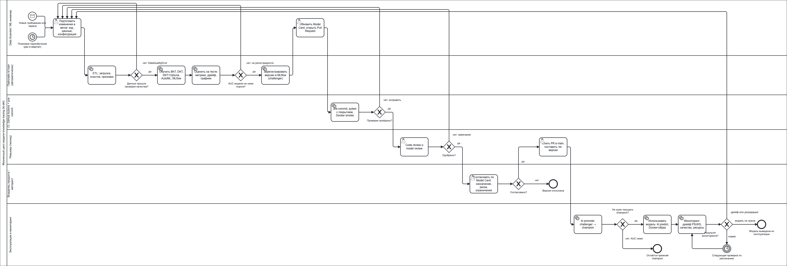

# Жизненный цикл модели и workflow согласования (BPMN)

Процесс описывает путь модели knowledge tracing (`kt-dkt`, DKT+Optuna) от
появления задачи до вывода из эксплуатации: подготовку изменений,
автоматическое обучение и проверки, согласование, продвижение в рабочую
версию и мониторинг.

Диаграмма — [`bpmn/model_lifecycle.bpmn`](bpmn/model_lifecycle.bpmn)
(BPMN 2.0, открывается в [Camunda Modeler](https://camunda.com/download/modeler/)
или на [demo.bpmn.io](https://demo.bpmn.io/)), изображение —
[`bpmn/model_lifecycle.png`](bpmn/model_lifecycle.png).

## Участники (дорожки)

| Дорожка | Кто | Ответственность |
|---|---|---|
| Data Scientist / ML-инженер | автор изменений | готовит изменения в ветке, обновляет Model Card, открывает Pull Request, дорабатывает по замечаниям |
| Пайплайн `kt train` | автоматическая система | ETL, data-quality gate, обучение четырёх моделей, оценка и мониторинг дрейфа, упаковка и регистрация модели |
| CI: GitHub Actions + pre-commit | автоматическая система | статические проверки, тесты с покрытием, сборка и smoke-запуск Docker-образа |
| Ревьюер (техлид) | человек | code review и model review, слияние в `main` |
| Владелец продукта / методист | человек | согласование по Model Card: назначение, ограничения, риски |
| Эксплуатация и мониторинг | ML-инженер и автоматические проверки | продвижение версии, использование модели, мониторинг |

## Запуск процесса

Процесс начинается с одного из трёх событий:

1. **Новое требование или задача** (стартовое событие-сообщение): новая
   версия модели, изменение признаков, исправление ошибки.
2. **Плановое переобучение** (стартовое событие-таймер): раз в квартал на
   свежих данных.
3. **Сигнал мониторинга**: значимый дрейф признаков (PSI ≥ 0.25) или
   деградация качества — возврат из шлюза «Результат мониторинга?» к
   подготовке изменений.

## Шаги, шлюзы и их реализация в репозитории

Каждый автоматический шлюз диаграммы — это проверка в коде или в CI, каждый
ручной — шаг Pull Request на GitHub.

| № | Элемент BPMN | Тип | Дорожка | Правило / критерий | Где реализовано |
|---|---|---|---|---|---|
| 1 | Подготовить изменения в ветке | пользовательская задача | Data Scientist | изменения только в отдельной ветке, не в `main` | хук `no-commit-to-branch` в `.pre-commit-config.yaml`; защита ветки `main` на GitHub |
| 2 | ETL: загрузка, очистка, признаки | сервисная задача | Пайплайн | сплит по студентам, причинные признаки | `kt train` → `etl/run.py` |
| 3 | Данные прошли проверки качества? | исключающий шлюз | Пайплайн | пять проверок: схема, пропуски, бинарные метки, диапазон навыков, уникальность `(user_id, order_idx)` | `monitoring/data_quality.py`: `DataQualityError`, код выхода `kt` — 3; флаг `monitoring.fail_on_data_quality` |
| 4 | Обучить BKT, DKT, DKT+Optuna, AutoML; MLflow | сервисная задача | Пайплайн | одинаковые данные и протокол для всех моделей | `models/registry.py`, `pipeline.train_and_evaluate`; запуск MLflow |
| 5 | Оценить на тесте: метрики, дрейф, графики | сервисная задача | Пайплайн | one-step-ahead, метрики одной функцией | `evaluation/metrics.py`, `monitoring/drift.py`, `artifacts/metrics.json` |
| 6 | AUC модели не ниже порога? | исключающий шлюз | Пайплайн | test AUC ≥ `serving.min_test_auc` (0.75); smoke-прогоны (`kt train --quick`) не регистрируются | `pipeline.package_model` |
| 7 | Зарегистрировать версию в MLflow (challenger) | сервисная задача | Пайплайн | новая версия `kt-dkt` с алиасом `challenger` и тегами `test_auc`, `data_source` | `tracking.mark_challenger` |
| 8 | Обновить Model Card, открыть Pull Request | пользовательская задача | Data Scientist | карточка отражает новую модель | `MODEL_CARD.md`, Pull Request в `main` |
| 9 | pre-commit, pytest с покрытием, Docker smoke | сервисная задача | CI | ruff, mypy, тесты, покрытие ≥ 90 %, образ запускает `kt train --quick` | `.github/workflows/ci.yml` |
| 10 | Проверки пройдены? | исключающий шлюз | CI | все проверки зелёные | обязательные статусы `lint-and-test` и `docker-smoke` в защите ветки `main` |
| 11 | Code review и model review | пользовательская задача | Ревьюер | регрессия против `docs/baseline/` (`scripts/compare_metrics.py`), метрики не хуже `champion`, Model Card обновлена | ревью Pull Request |
| 12 | Одобрено? | исключающий шлюз | Ревьюер | approve или request changes | ревью Pull Request на GitHub |
| 13 | Согласовать по Model Card | пользовательская задача | Владелец продукта | назначение, ограничения и риски приемлемы для использования | разделы 2, 7 и 8 `MODEL_CARD.md` |
| 14 | Согласовано? | исключающий шлюз | Владелец продукта | решение по Pull Request | одобрение или отклонение Pull Request |
| 15 | Слить PR в `main`, поставить тег версии | пользовательская задача | Ревьюер | слияние только после зелёного CI | merge Pull Request на GitHub, git-тег |
| 16 | `kt promote`: challenger → champion | сервисная задача | Эксплуатация | алиас `champion` переходит на одобренную версию | `kt promote` → `tracking.promote` |
| 17 | Не хуже текущего champion? | исключающий шлюз | Эксплуатация | test AUC `challenger` ≥ test AUC `champion`, иначе отказ (код выхода 4); `--force` — осознанное исключение | `tracking.promote` |
| 18 | Использовать модель | сервисная задача | Эксплуатация | P(correct) по каждому навыку из истории студента | `kt predict --model models:/kt-dkt@champion`, Docker-образ |
| 19 | Мониторинг: дрейф, качество, ресурсы | сервисная задача | Эксплуатация | PSI < 0.10 — стабильно, 0.10–0.25 — умеренный дрейф, ≥ 0.25 — значимый | `monitoring/drift.py`, `monitoring/resources.py`, отчёты в MLflow |
| 20 | Результат мониторинга? | исключающий шлюз | Эксплуатация | значимый дрейф или деградация → переобучение; норма → следующая плановая проверка; модель больше не нужна → вывод из эксплуатации | пороги `monitoring.psi_warn`, `monitoring.psi_alert` в `config/config.yaml` |

### Завершения процесса

| Конечное событие | Когда |
|---|---|
| Версия отклонена | владелец продукта не согласовал версию по Model Card |
| Остаётся прежний champion | `kt promote` отказал: новая версия хуже действующей |
| Модель выведена из эксплуатации | задача больше не актуальна; алиас `champion` снимается, версии остаются в реестре для аудита |

## Как процесс закреплён в репозитории

- **Изменения только через Pull Request.** Локально коммит в `main`
  блокирует хук `no-commit-to-branch`, на GitHub — защита ветки: слияние
  через Pull Request и только при зелёных проверках `lint-and-test` и
  `docker-smoke`.
- **Автоматические шлюзы останавливают процесс сами:** data-quality gate
  (`kt train` завершается с кодом 3), порог регистрации (модель ниже порога
  не становится `challenger`), CI (Pull Request нельзя слить), правило
  продвижения (`kt promote` завершается с кодом 4).
- **Ручные шлюзы** — ревью Pull Request и согласование по Model Card.
- **Трассируемость.** Каждая версия в реестре связана с запуском MLflow
  (параметры, метрики, графики, отчёты мониторинга), с тегом git и с
  описанием в `MODEL_CARD.md`.
- **Роли в учебном репозитории.** Здесь все человеческие роли совмещает
  автор; GitHub не засчитывает одобрение собственного Pull Request, поэтому
  обязательное число одобрений в защите ветки не задано.
